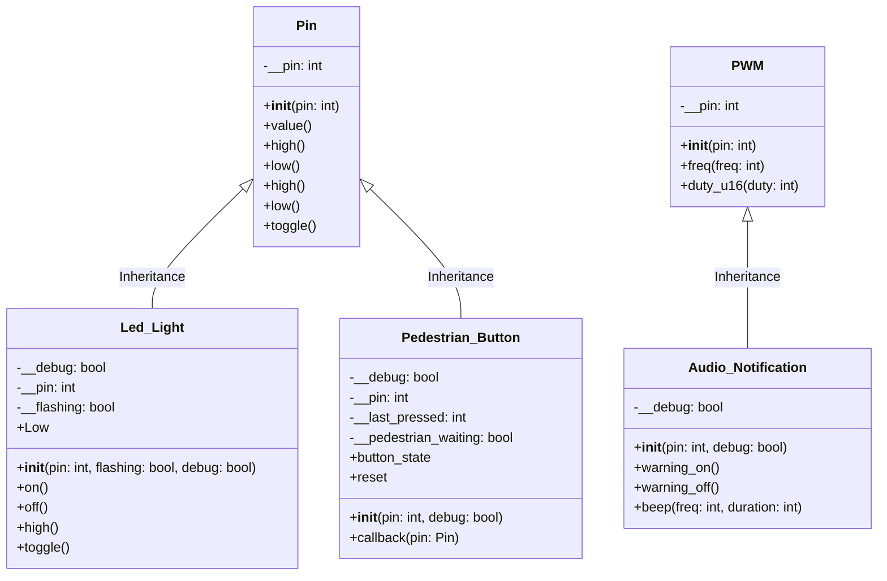

# Lecture 1

## Lecture 1 Concepts
- Unit Testing
- Generalisation
- Parent/Child Class
- Pin & PWM Parent Classes
- Instantiation
- Inheritance

## Unit Testing

Unit testing is the process of writing and running small, isolated tests that check the correctness of individual pieces of code (such as functions or modules). The goal is to ensure that each unit of your embedded software works as expected, independently from the rest of the system.

Unit testing is especially valuable in embedded systems, such as the Pi Pico, where debugging can be challenging due to limited resources and hardware complexity. By ensuring each component works independently, you can build more complex mechatronic solutions.

## Generalisation

On the Pi Pico, the Pin and PWM libraries are designed to be generalised to provide flexible and reusable interfaces for interacting with the microcontroller’s hardware. The simple `on()`, `off()` or `high()`, `low()` methods are not specific to any hardware but are generalised to the nature of a digital GPIO Pin. As a generalised class is inherited and the classes are extended, they become more specific (less generalised) and functional to specific hardware for which they are designed.

## Parent/Child Classes

A parent/child (or super/sub) class relationship is a key concept in object-oriented programming (OOP), also known as inheritance. The parent class defines common attributes and methods.
It acts as a template for other classes.



## Pin Library

[Machine.Pin Library Documentation](https://docs.micropython.org/en/latest/library/machine.Pin.html)

The Pin library in MicroPython for the Pi Pico allows you to control the General Purpose Input/Output (GPIO) pins of the Pico. It allows you to configure pins as digital (binary) inputs or outputs.

## PWM Library

[Machine.Pin Library Documentation](https://docs.micropython.org/en/latest/library/machine.PWM.html)

The PWM Library provides an interface for controlling PWM signals on a specified GPIO pin. It allows you to configure any GPIO pin as a PWM and set the duty cycle and frequency.

## Instantiation

A class is like a blueprint for an object—it defines the attributes and methods the object will have, but it isn’t an actual object itself. Instantiation is the process of using the class to create a real, usable object in memory.

```python
from machine import Pin
from time import sleep

led_car_red = Pin(3, Pin.OUT)
led_car_orange = Pin(5, Pin.OUT)
led_car_green = Pin(6, Pin.OUT)

while(True):
    led_car_red.toggle()
    led_car_orange.toggle()
    led_car_green.toggle()
    sleep(1)
```

## Inheritance

Inheritance is a fundamental concept in object-oriented programming (OOP). It allows a class (called a child or subclass) to inherit properties and behaviours (methods and attributes) from another class (called a parent or superclass).

In this case, the `Led_Light` class inherits from the Pin class, and without any further instructions, the subclass inherits and can call all the methods of the superclass, including `on()`, `off()`, `high()`, `low()`, `toggle()`, etc.


```python
from machine import Pin
from time import sleep

class Led_Light(Pin):
    # child class inherits the parent 'Pin' class
    def __init__(self, pin):
        super().__init__(pin, Pin.OUT)

red_light = Led_Light(3)

while True:
    red_light.on()
    sleep(0.5)
    red_light.off()
    sleep(0.5)
    red_light.high()
    sleep(2)
    red_light.low()
    sleep(2)
    red_light.toggle()
    sleep(4)
    red_light.toggle()
    sleep(4)
```
