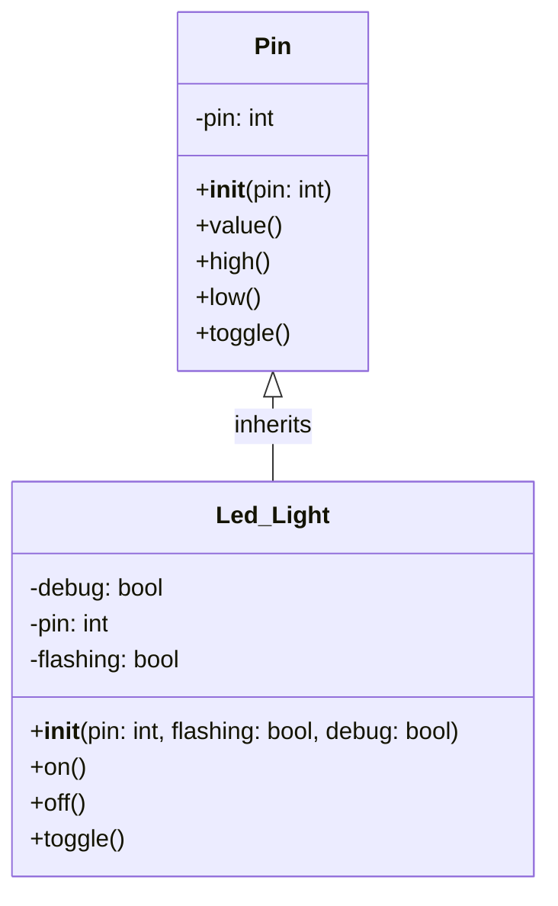

# Lecture 2

## Lecture 2 Concepts
- UML (Unified Modelling Language)
- Overriding Polymorphism
- DRY
- Overloading Polymorphism

## UML Class Diagrams

A UML (Unified Modelling Language) class diagram visually describes the structure of a system by showing its classes, their attributes (variables), methods (functions), and relationships (like inheritance).

```text
----------------------
|     Student        |   <-- Class Name
----------------------
| -name: String      |   <-- Attributes
| -age: int          |
----------------------
| +getName(): String |   <-- Methods
| +setAge(int): void |
----------------------
```

### Mermaid Markdown UML Class Diagram Example
Below is a Mermaid class diagram for a Pi Pico GPIO Pin and a custom Led_Light class that inherits from it.



Explanation:

1. Class Name (Top Section): This is the uppermost part of the box. It displays the name of the class (e.g., Student, Order, Car).
2. Attributes (Middle Section): This section lists the attributes (or properties/fields) of the class. Each attribute is typically shown with its visibility (+ for public, - for private, # for protected), name, and type.
3. Methods (Bottom Section): This section lists the methods (or operations/functions) that belong to the class.
Each method is shown with its visibility, name, parameters, and return type.
4. Connections (lines and arrows): These lines and arrows represent relationships (such as inheritance, association, aggregation, and composition) between class boxes.

## Overriding Polymorphism

**Polymorphism means “many forms.”**

Polymorphism Overriding occurs when a child class (subclass) provides a new implementation for a method it inherits from its parent class (superclass).

The method in the child class has the same name and parameters as the one in the parent class. When the method is called on an object of the child class, Python (or any object-oriented language) uses the child’s version—even if the object is referenced using the parent type.

```python
from machine import Pin
from time import sleep

class Led_Light(Pin):
    # child class inherits the parent 'Pin' class
    def __init__(self, pin, flashing=False, debug=False):
        super().__init__(pin, Pin.OUT)
        self.__debug = debug
        self.__pin = pin
        self.__flashing = flashing

    def on(self):
        # method overriding polymorphism of the parent class
        self.high()
        if self.__debug:
            print(f"LED connected to Pin {self.__pin} is high")

    def off(self):
        # method overriding polymorphism of the parent class
        self.low()
        if self.__debug:
            print(f"LED connected to Pin {self.__pin} is low")

    def toggle(self):
        # method overriding polymorphism of the parent class
        if self.value() == 0:
            self.on()
        elif self.value() == 1:
           self.off()


red_light = Led_Light(3, False, False)

while True:
    red_light.on()
    sleep(1)
    red_light.off()
    sleep(1)
```

## DRY
The DRY pattern stands for "**Don't Repeat Yourself**"; it is a fundamental principle of programming aimed at reducing repetition of code and logic. This is to avoid duplicating code, logic, or data.

### Why Use DRY?
- Maintainability: When logic is defined in only one place, updates or bug fixes are only needed once.
- Readability: The code is easier to read and understand because there is less repetition.
- Consistency: Reduces the risk of inconsistencies and errors that can occur when updating duplicated code in multiple places.

```python
##### WET #####
    def on(self):
        # method overriding polymorphism of the parent class
        self.high()
        if self.__debug:
            print(f"LED connected to Pin {self.__pin} is high")

    def off(self):
        # method overriding polymorphism of the parent class
        self.low()
        if self.__debug:
            print(f"LED connected to Pin {self.__pin} is low")

    def toggle(self):
        # method overriding polymorphism of the parent class
        if self.value() == 0:
            self.high()
            if self.__debug:
                print(f"LED connected to Pin {self.__pin} is high")
        elif self.value() == 1:
           self.low()
            if self.__debug:
                print(f"LED connected to Pin {self.__pin} is low")

##### DRY #####
    def on(self):
        # method overriding polymorphism of the parent class
        self.high()
        if self.__debug:
            print(f"LED connected to Pin {self.__pin} is high")

    def off(self):
        # method overriding polymorphism of the parent class
        self.low()
        if self.__debug:
            print(f"LED connected to Pin {self.__pin} is low")

    def toggle(self):
        # method overriding polymorphism of the parent class
        if self.value() == 0:
            self.on()
        elif self.value() == 1:
           self.off()

```

## Overloading Polymorphism

**Polymorphism means “many forms.”**

Overloading occurs when a child (subclass) and/or parent (superclass) have multiple methods with the same name but different parameters (number or type).

When you call the method, depending on the parameters passed, the corresponding method is executed.

Because Python is dynamically typed, it does not support overloaded polymorphism, as the last definition of a method overwrites any previous ones.

```pseudocode
Class Led_Light inherits from Pin:
    Method __init__(pin, flashing = False, debug = False):
        Call parent class (Pin) constructor with pin and output mode
        SET led_light_state (property, see below)
        PRIVATE SET debug attribute to debug
        PRIVATE SET pin attribute to pin
        PRIVATE SET flashing attribute to flashing

    METHOD on():
        SET the pin high
        If debug is enabled:
            Print "LED connected to Pin [pin number] is [led_light_state]"

    METHOD off():
        SET the pin low
        IF debug is enabled:
            Print "LED connected to Pin [pin number] is [led_light_state]"

    METHOD toggle():
        IF pin value is 0:
            CALL on()
        ELSE if pin value is 1:
            CALL off()

    METHOD led_light_state ():
        RETURN the pin's current value

    METHOD led_light_state (value):
       IF value is 1:
            CALL off()
        ELSE IF value is 0:
            CALL on()
```

> [!Note]
> The Following Implementation is not technically Polymorphism; it is just a demonstration of the idea that the same method can be called with different parameters.

```python
from machine import Pin
from time import sleep, time

class Led_Light(Pin):
    # child class inherits the parent 'Pin' class
    def __init__(self, pin, flashing=False, debug=False):
        super().__init__(pin, Pin.OUT)
        self.led_light_state
        self.__debug = debug
        self.__pin = pin
        self.__flashing = flashing

    def on(self):
        # method overriding polymorphism of the parent class
        self.high()
        if self.__debug:
            print(f"LED connected to Pin {self.__pin} is {self.led_light_state}")

    def off(self):
        # method overriding polymorphism of the parent class
        self.low()
        if self.__debug:
            print(f"LED connected to Pin {self.__pin} is {self.led_light_state}")

    def toggle(self):
        # method overriding polymorphism of the parent class
        if self.value() == 0:
            self.on()
        elif self.value() == 1:
           self.off()

    @property
    def led_light_state(self):
        # method overloading polymorphism in this class
        return self.value()

    @led_light_state.setter
    def led_light_state(self, value):
        # method overloading polymorphism in this class
        if value == 1:
            self.off()
        elif value == 0:
            self.on()


red_light = Led_Light(3, False, False)

while True:
    print(red_light.led_light_state)
    red_light.led_light_state = 1
    sleep(0.25)
    print(red_light.led_light_state)
    red_light.led_light_state = 0
    sleep(0.25)
```
